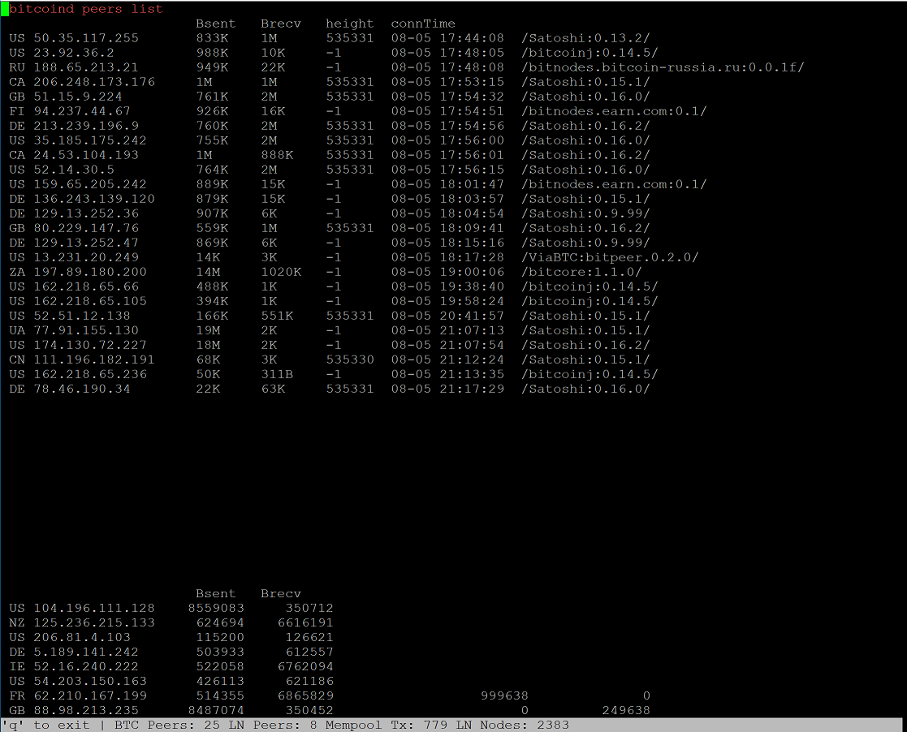

# boltsnap
htop like monitoring of bitcoind and lnd nodes

Python based monitoring snapshot for Bitcoin Core node and Lightning Network Daemon (LND)
Screen updates every 2sec.

Requires:
pip3 install hurry.filesize --user

pip3 install python-geoip-python3 --user

